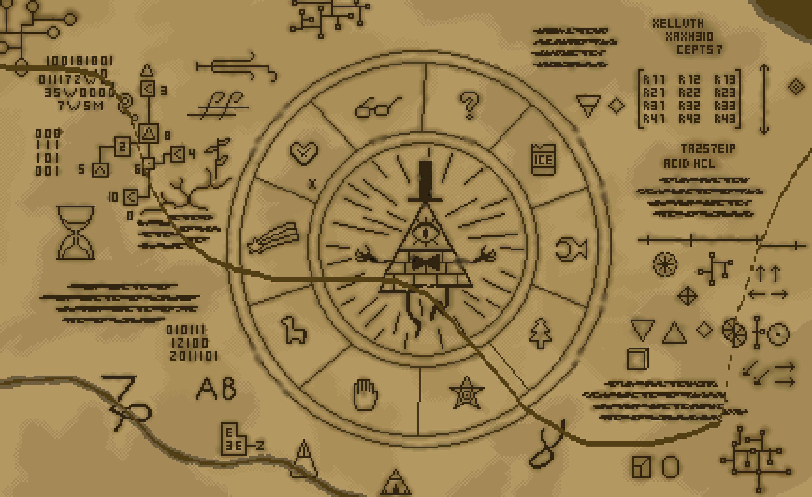

  

Hi there! I'm a game programmer with a passion for pixel art games

### Some of my works
  

Contact me at:
- 📫 ttnam957@gmail.com
- [Facebook](https://www.facebook.com/profile.php?id=61554875248180)

### My random artworks
<!--  -->

<table>
    <tr>
        <th>Bill Cipher</th>
        <th>Chucky</th>
    </tr>
    <tr>
        <td></td>
        <td></td>
    </tr>
</table>

### Repos
- UPack: Packages for Unity
- USample: My sanbox projects for testing things with Unity
- TNxxx: My personal projects

## Hey, look, this snake is eating my contributions!
<picture>
  <source media="(prefers-color-scheme: dark)" srcset="https://raw.githubusercontent.com/NamPhuThuy/NamPhuThuy/output/github-contribution-grid-snake-dark.svg">
  <source media="(prefers-color-scheme: light)" srcset="https://raw.githubusercontent.com/NamPhuThuy/NamPhuThuy/output/github-contribution-grid-snake.svg">
  
</picture>
